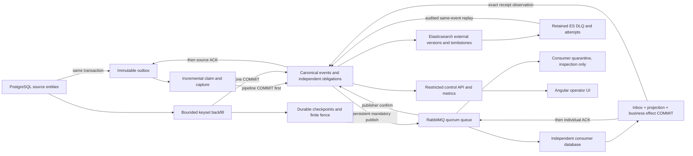

# Kill It Twice

A retained local replication application: PostgreSQL source and outbox, resumable backfill plus incremental capture, Elasticsearch search, RabbitMQ stream, independent consumer effects, and an Angular operator UI.

**Local final acceptance passed on 2026-09-24**, at tested commit `ecdfdb5063aa7977af6bceccdaa6b1ece3fdece7`: the complete `make verify`, all G1-G5 gates, exact million-baseline reconciliation, five corruption controls and both child cleanups passed. The separate 1,024-baseline functional run also passed. See the [final evidence](docs/evidence/Final-submission-2026-09-24.md), [acceptance matrix](docs/acceptance-matrix.md) and [closure decision](docs/acceptance-closure.md). This is local execution; interrupted server acceptance, hosted CI, optional 2M and publication are not claimed.

## Prerequisites and quick start

Linux x64 with a local Docker daemon, Compose, Git, make, Python 3 with SQLite, Node **24.19.0**, npm **12.0.2**, and an installed Chromium/Chrome. `UI_CHROMIUM_PATH` selects an existing browser. The Docker host needs `vm.max_map_count >= 1048576`; checks do not change the host or install system packages. Full acceptance requires at least 8 GiB available memory and 80 GiB free on both evidence and Docker storage filesystems; it retains a 2 GiB memory / 10 GiB disk safety reserve. The existing shared-host observations are not dedicated-hardware benchmarks.

```sh
npm ci --no-audit --no-fund
npm run tools:provision          # pinned local actionlint, no privileged install
npm run runtime:preflight
# Select a distinct name/port when another installation exists.
export COMPOSE_PROJECT_NAME=kit-local-demo
export KIT_UI_PORT=4200
docker compose up -d --build
make seed SEED_COUNT=1024
make runtime-status
make operator-token             # private local token; do not save in a report
```

Open [the local operator UI](http://127.0.0.1:4200). Compose builds the image from this checkout. Initializers generate installation-local credentials/TLS material in named volumes; workers receive restricted roles, and the browser receives no database credentials. Only the gateway is published, on loopback. The token is held in browser page memory. No committed secret, ignored configuration or downloaded evidence archive is needed.

`make seed` is explicit, bounded and resumable under the same manifest. A conflicting count fails; activation and scheduled backfill do not mean receiver completion. Normal restart retains identity, data, credentials, checkpoints and historical outcomes:

```sh
docker compose down             # retain volumes
docker compose up -d
```

Keep the same Compose project name for this restart. Removing its volumes destroys that installation. Automated verification uses its own unique projects, ports and volumes and removes only those resources.

## Verification

```sh
make verify                      # default: 1,000,000 genuine ~1 KiB baselines
make verify-functional           # fresh 1,024-baseline development fault repeat
make verify-runtime              # root setup, seed, retained restart and real UI controls
make verify-ui                   # rendered browser fixture inventory, separate from live proof
# Optional, explicitly selected capacity target:
make verify VERIFY_COUNT=2000000
```

Run final acceptance from clean committed code after installation. `make verify` executes quality, browser fixture checks, the separate 257-baseline retained-runtime/control fixture, then real G1-G5 faults and 519 unique mutations on the **selected large installation**. It does not read an old summary to obtain PASS. [The final gate contract](docs/final-gates.md) describes the actual fault boundaries. A green fast CI job proves only its named small fixture; full acceptance is a separate optional manual job on an explicitly provisioned capacity runner. No hosted result is implied by local workflow validation.

| Gate | Required observed behavior                                                                                                                                                                                      |
| ---- | --------------------------------------------------------------------------------------------------------------------------------------------------------------------------------------------------------------- |
| G1   | Prior committed pages, actual page writes before COMMIT, independent open-transaction/cursor observation, scanner SIGKILL, unchanged durable checkpoint and resumed progress with overlapping source mutations. |
| G2   | Actual redelivery after consumer COMMIT-before-ACK and duplicate publication after broker confirm-before-local-settlement; one effect per unique mutation.                                                      |
| G3   | Real Elasticsearch service outage lasting at least 60 measured seconds, durable backlog, bounded attempts, independent broker/consumer progress and recovery.                                                   |
| G4   | One actual 500-operation bulk, 497 successes and three independently predeclared mapping rejections with retained DLQ evidence.                                                                                 |
| G5   | Real status/metrics/browser observations of progress, useful throughput, lag, failures and dependency/data health.                                                                                              |

Exports and the independent disk-backed oracle compare exact identity sets, versions, payloads, tombstones, event history, source ACKs, receipts and business effects. Five corrupt-export controls must be detected. Full terminal run validation remains mandatory; short status observations explicitly do not revalidate integrity, and unknown fields remain unknown. Failed phases and unattempted gates are distinct. Cleanup failure makes the entire command nonzero.

Reports, input hashes, source snapshots, commands, fault markers, exports, resource samples and screenshots are written to ignored `artifacts/final/`, `artifacts/runtime/` and `artifacts/ui/`. They are local files, not public download links. [Dated evidence](docs/evidence/) retains previous results and failures at their original code identities.

## Architecture and commit boundaries



Source and pipeline are separate PostgreSQL services/transaction domains. The consumer owns a separate database and credentials on the state service. Source mutations commit their immutable after-images atomically. Backfill pages commit staging and checkpoint evidence together. A finite source fence closes a run without preventing later incremental capture.

Delivery is **at least once**, with monotonic versioned projections and effectively-once defined consumer database effects. Each unique mutation contributes one audit effect and one aggregate unit; baseline observations do not. A source ACK means durable staging, a publisher confirm means broker acceptance, and a consumer receipt means database COMMIT. They are separate facts. There is no cross-sink atomic visibility or end-to-end exactly-once claim. Ambiguous outcomes remain unresolved until identity-based recovery proves them.

These guarantees assume intact retained storage, controlled source privileges, trusted runtime roles, no incompatible independent database restore, and eventual healthy service time/capacity. Finite storage cannot absorb unlimited writes. Persistent tombstones and exact canonical event bytes prevent stale resurrection and content substitution. Runtime never recreates registered receivers or resets another sink to replay Elasticsearch.

## Operator use and recovery

The UI opens read-only. Connect the installation token only for an intended command. Overview separates staging, broker confirmation and consumer effects; missing/last-known observations are labeled. Records provides search, current details and exact identifiers. Backfill supports start, pause and resume; pause is admission control, so in-flight pages may still commit. Request acceptance is shown as scheduling, not completed delivery.

Failures exposes current and historical ES attempts, source blocks and consumer quarantine. ES replay targets the current terminal attempt, retains the original canonical event and all previous failures, and preserves broker/consumer success. Unchanged invalid content can fail again. Correcting source data creates a newer revision; explicit verified supersession is available through the existing [operations CLI](docs/operations.md). Consumer quarantine has **no public replay/purge control**.

Simulations operates sixteen named source fixtures (create/update/delete/restore), a real invalid mapped revision, and configured Toxiproxy disconnect/reconnect controls. It does not offer arbitrary SQL, arbitrary payloads or host commands. Configuration displays immutable identities, actual API limits and restart-required connection settings; automatic browser refresh is the supported local toggle. See [metric definitions](docs/metric-definitions.md), [UI contract](docs/ui-verification-contract.md) and [interface design](docs/ui-design.md).

## Decisions and provenance

The first commit `251cb5a` contains SPEC, AGENTS, ADRs 001-004 and the initial milestone before harness `7af0818` and implementation `5368de6`. Architecture was selected through AI-assisted review before implementation; it is not presented as a later agent discovery. [SPEC](SPEC.md) preserves that adoption context and subsequent deliberate refinements. [AGENTS](AGENTS.md) records workflow constraints.

Meaningful decisions include [transactional capture](docs/adr/001-source-capture.md), [delivery semantics](docs/adr/002-delivery-semantics.md), [identity and tombstones](docs/adr/003-revision-identity-and-tombstones.md), [atomic staging](docs/adr/008-atomic-pipeline-staging.md), [consumer COMMIT/ACK](docs/adr/011-rabbitmq-consumer.md), [finite backfill](docs/adr/013-backfill-checkpoints-fence.md), [audited operations](docs/adr/014-operational-control-replay.md) and [retained runtime](docs/adr/015-retained-local-runtime.md). Earlier module setup/limitations are retained in [historical notes](docs/history/README-milestones.md).

## Capacity and limits

The verified default is one million distinct roughly-1-KiB entities, with each worker limited to **256 MiB**, Node heap **128 MiB**, each page at most **64 records / 256 KiB**, and per-event validation unchanged. The completed run contained **1,034,667,793 baseline payload bytes**, about 3.85 worker budgets; the largest observed worker process RSS high-water value was 147,918,848 bytes. These are sampled shared-host observations, not a dedicated-hardware benchmark. The earlier 2M plan remains historical and its optional profile is not claimed executed.

[Capacity notes](docs/capacity-notes.md) retain measured CPU, memory, storage, seed/drain/export/oracle duration and bottlenecks. At `93eac82`, 262,144 baselines passed exact reconciliation and cleanup with four scanners/two sink workers; this was a baseline-only capacity run. It does not prove faults at one million rows. On earlier single shared-host 131,072 runs, the same page64 configuration with an equivalent due-index predicate reduced observed completion time from 1,175 to 660 seconds, about **1.78x**, not an asserted 2x. Doubling effective throughput would require roughly halving the limiting stage's per-record service demand or independently doubling its processing capacity without database contention; that is an untested hypothesis, not a promised result or additional work programme.

Intentionally excluded: cloud deployment, multi-node HA, multi-tenancy, a generic connector framework, arbitrary external effects, Kafka/Kubernetes, automatic retention/GC, live receiver replacement, generic retries, public quarantine replay and additional polished screens. They are unnecessary to demonstrate this assignment and would broaden its failure/authority contract.

## Two concrete AI deviations

1. **Consumer wire accounting.** Requested: admit at most 32 original messages / 1,048,576 canonical wire bytes consistently in application and SQL, with COMMIT before ACK. The generated SQL used a different charge, so a legal 32-message cohort totaling exactly 1,048,576 bytes was charged 1,049,056 and rejected with `P6002`. Real RabbitMQ redelivery and unchanged database effects were retained, not called success. Correction `0a375fd` aligned the forward SQL accounting; clean `bba6465` passed fresh and populated B02-B08/B06H checks. [Reproduction and correction evidence](docs/evidence/M4.1-development.md).
2. **Rejected-update oracle.** Requested: a rejected v2 must leave the previously admissible v1 document (or tombstone) intact, while unexpected missing/corrupt data fails. The generated oracle excluded the whole entity when its latest revision was rejected and falsely failed an unchanged valid v1 receiver. Diagnostic `94c0d74` reproduced the actual mapping rejection and exact old-oracle failure. Correction `d1b3baa` used verifier-owned expected admissible revisions and real negative controls; O01-O06 passed. [Reproduction and correction evidence](docs/evidence/M3.1-development.md).

Neither example is invented to meet a quota. The reports distinguish original review findings, diagnostic reproduction, implementation correction and later acceptance.

## Submission handoff

This task produces local commits and local evidence only. Publishing/pushing the candidate and any sanitized evidence requires separate authorization; a READY local result does not mean GitHub has received it. The [acceptance matrix](docs/acceptance-matrix.md) identifies any remaining blocker and the exact tested versus later documentation identities.
