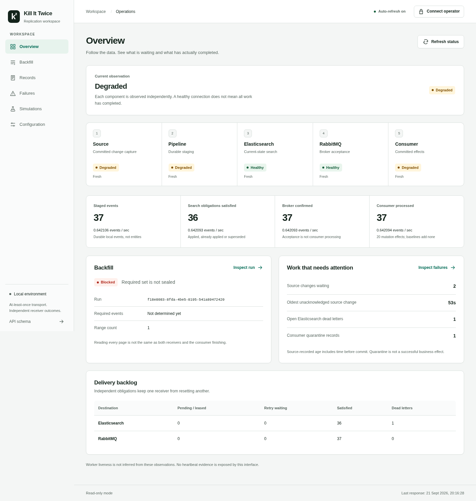

# Operator interface — executed checks

2026-09-21. The Angular interface is implemented over the existing operational API. This report distinguishes browser-response fixtures, actual isolated service observations, and the earlier M6 capture qualification. It does not claim complete G1–G5, scale, deployment, or a comprehensive accessibility certification. No remote push or workflow dispatch occurred.

## Identities and scope

The principal interface commit is a442e15e0ef3ac5072f0af3691741a0eaa977783. Modal observation timing was corrected in dc98ecd0b898f6a458d67ed464e87c78bce9f246. The final visual correction and stronger enlarged-heading assertion are 299b4ba1790bdbc1817503d41237879e9f8f569a. This later documentation records those tested identities rather than substituting its own SHA.

The user-installed nine skills and skills-lock.json remain byte-identical to import 8bcdaeee91d3d2fd15f925df6ffad747f9941cd7. Upstream MIT notices were added, and only vendored skill text was excluded from formatting. The misleading subject of that import is documented without rewriting history. The initial interface plan preceded source implementation; all nine skills were read and applied to their relevant domains in [the design record](../ui-design.md).

Existing src/ domain code, SQL migrations and prior direct dependency versions remain unchanged. The read-only HTTP status route now delegates to the existing OperationalMonitor so rates, identity validation and last-known observations have one authoritative implementation. No new source, receiver, consumer or replay mutation contract was introduced.

## Actual checks

At clean dc98ecd, the captured sequence completed npm ci, make verify-ui, test:ui:live, the populated M6 upgrade, a fresh browser repeat, and the intentionally failing full make verify. All expected exits matched. The real live fixture passed 24 operational cases; the populated upgrade passed three. The existing unit suite passed 64 cases; browser fixtures passed all independently required U01–U10 with no skips.

The live browser ran Chromium 152.0.7977.82 through an owned read-only HTTP transport to the actual isolated Nest/PostgreSQL/Elasticsearch service fixture. It observed 37 staged events, browsed receiver records and inspected entity 1. No API response was intercepted with fabricated data; no browser-driven mutation was performed. The separate confirmation/idempotency tests use explicitly isolated HTTP responses. Both service profiles completed their owned cleanup.

The screenshot contains synthetic test-business data processed by real services. It is not production or benchmark evidence.

At 299b4ba, make verify-ui passed again: 64 unit checks, Angular production build and U01–U10. Automated axe checks found zero violations in the six tested page states. The browser checks also exercised 320px navigation, dialog focus wrapping/Escape/return focus, memory-only credentials, unchanged keys/bodies on ambiguous retries, forced colors and reduced motion. Text scaling used a 200% computed-font override; it was not an OS/browser-zoom or physical-device test. No screen-reader session was performed.

Build output reported 285.88 kB initial raw chunks and 79.07 kB estimated transfer, with six lazy page bundles. These are build reports, not runtime memory or network benchmarks. Interface dependencies use Angular 21.2.23, CLI/build 21.2.24, playwright-core 1.63.0 and axe 4.13.0 with the existing Node 24/TypeScript 5.9 toolchain.

## Actual corrections and limitations

Developmental checks found template/type/unused-export issues, an absolutely positioned hidden table label that widened a 320px page, and an incomplete Tab wrap at a native dialog boundary. Those were fixed rather than suppressing the quality rules. One clean browser capture subsequently failed because it asserted absence before the dialog close rendered; the test now waits for actual hidden state and keeps the absence assertion. The first real UI/API test read the old Overview table before the lazy Records route was ready; it now requires the Records heading before inspecting its table. Its failed 23/24 operational run is retained.

Visual inspection at doubled text size measured the Elasticsearch component heading at 181px content inside a 156px box. The final CSS allows its text to wrap, and the browser test explicitly verifies each component heading's content fits. The earlier document-width assertion alone did not detect that clipping. Final changes after dc98ecd affect only this CSS and its regression; the live API/transaction paths are unchanged, not falsely described as rerun under the newer SHA.

The runtime contains no fixture fallback. When the local API is absent, the interface shows unavailable/unknown state rather than sample metrics. Advanced M6 recovery remains available through its CLI; the interface exposes only controls supported by its current HTTP routes. It does not initialize the entire service stack. Test services are removed after verification.

The original M6 capture remains FAIL because its final root-checkout guard observed later authorized skills/UI work. Both isolated full test invocations nevertheless completed at their original clean code identity. Their independent qualification is retained in [M6 isolated-gate evidence](M6-isolated-gates.md); this UI result does not rewrite that capture into PASS.

## Reproduction and artifacts

`make verify-ui` runs quality, builds the application, and executes the independently inventoried browser cases. `npm run test:ui:live` separately builds both applications and requires the actual live-browser evidence in a real operational fixture. A missing browser or missing required case fails; verification does not silently install privileged system dependencies. UI_CHROMIUM_PATH may select an already installed browser.

The compact [machine summary](Operator-UI-summary.json) records separate code identities, command results, fixture checks and live observations. Complete logs/screenshots are local paths under `artifacts/ui/acceptance-20260921T161300Z/`, `artifacts/ui/browser-20260921162136681-9e8b3441/`, and the referenced isolated M6 run. Local artifact paths are not public download links. The qualified M6 bundle and subsequent UI bundle preserve their own hashes and limitations. No new hosted CI run was requested or observed. The local workflow now requires the same UI gate when it is later published by the owner.
